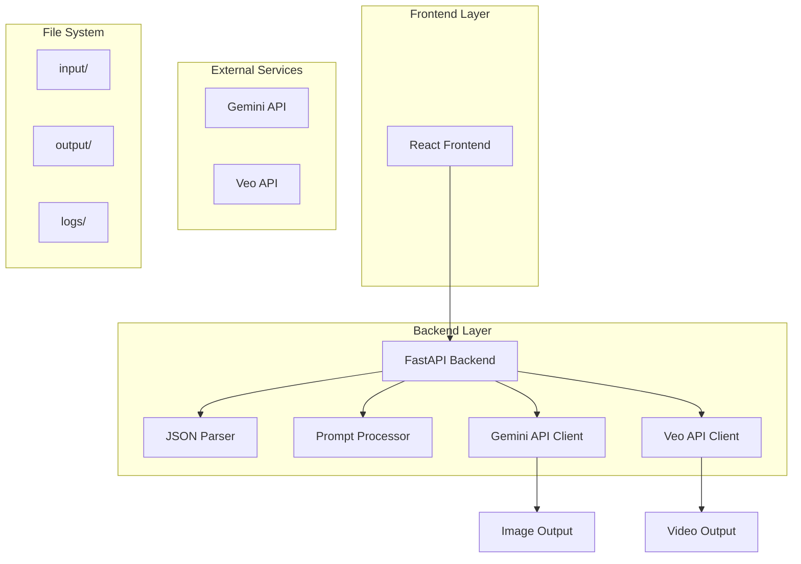
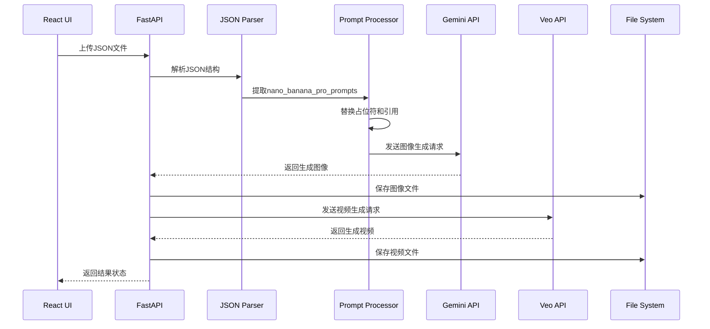

# AI图像视频生成应用开发计划

## 1. 项目概述

本项目是一个基于React前端和Python后端的AI图像视频生成应用，主要功能包括：
- 解析JSON输入文件中的图像生成提示词
- 使用Gemini API生成高质量图像
- 使用Veo API生成视频内容
- 提供可视化配置界面和响应式用户体验

### 核心目标
- 自动化处理输入数据并生成视觉内容
- 提供友好的用户界面进行参数配置
- 确保跨平台兼容性和可扩展性

## 2. 系统架构

### 2.1 整体架构图



### 2.2 技术栈

- **前端**: React@18 + Vite + Tailwind CSS
- **后端**: FastAPI + Pydantic + Python 3.9+
- **API集成**: Google Gemini API、Veo API
- **初始化工具**: vite-init (前端)
- **部署**: Docker + 跨平台脚本

### 2.3 数据流



## 3. 开发计划

### 阶段1：项目初始化与后端核心（第1-2周）

**目标**: 建立项目基础架构，实现核心后端功能

**任务清单**:
- [ ] 创建项目目录结构
- [ ] 初始化React前端项目（Vite + TypeScript）
- [ ] 初始化Python后端项目（FastAPI）
- [ ] 实现JSON文件解析器
- [ ] 实现Prompt预处理逻辑
- [ ] 建立日志系统
- [ ] 编写单元测试

**交付物**:
- 可运行的前后端项目骨架
- JSON解析和Prompt处理功能
- 完整的日志记录机制

### 阶段2：API集成与文件处理（第3-4周）

**目标**: 集成AI服务API，实现图像和视频生成功能

**任务清单**:
- [ ] 集成Gemini API客户端
- [ ] 实现图像生成逻辑
- [ ] 集成Veo API客户端
- [ ] 实现视频生成逻辑
- [ ] 建立文件保存规范
- [ ] 实现错误处理和重试机制
- [ ] 编写集成测试

**交付物**:
- 完整的图像生成功能
- 完整的视频生成功能
- 规范化的文件输出系统

### 阶段3：前端界面开发（第5-6周）

**目标**: 开发用户友好的可视化界面

**任务清单**:
- [ ] 设计UI组件架构
- [ ] 实现文件上传界面
- [ ] 实现参数配置界面
- [ ] 实现进度显示和状态反馈
- [ ] 实现结果预览功能
- [ ] 实现响应式设计
- [ ] 编写前端测试

**交付物**:
- 完整的用户界面
- 前后端集成
- 响应式设计实现

### 阶段4：测试、优化与文档（第7-8周）

**目标**: 完善项目质量，准备开源发布

**任务清单**:
- [ ] 性能优化和代码重构
- [ ] 安全性和错误处理完善
- [ ] 编写用户文档
- [ ] 编写API文档
- [ ] 创建部署脚本
- [ ] 跨平台兼容性测试
- [ ] 开源项目准备（README、LICENSE等）

**交付物**:
- 完整的项目文档
- 可复现的部署方案
- 开源就绪的项目代码

## 4. 目录结构

```
/Volumes/SSD/Video_Cut/信与账/App/
├── frontend/                    # React前端项目
│   ├── src/
│   │   ├── components/         # UI组件
│   │   ├── pages/             # 页面组件
│   │   ├── services/          # API服务
│   │   ├── utils/             # 工具函数
│   │   └── types/             # TypeScript类型定义
│   ├── public/
│   ├── package.json
│   └── vite.config.ts
├── backend/                     # Python后端项目
│   ├── app/
│   │   ├── api/               # API路由
│   │   ├── core/              # 核心配置
│   │   ├── models/            # 数据模型
│   │   ├── services/          # 业务逻辑
│   │   ├── utils/             # 工具函数
│   │   └── tests/             # 测试文件
│   ├── requirements.txt
│   └── main.py
├── input/                       # 输入文件目录
│   └── Visual_Development_Prompts_Nano_Veo.json
├── output/                      # 输出文件目录
│   ├── project-*/
│   │   ├── scene-*/
│   │   │   └── shot-*/
│   └── temp/
├── logs/                        # 日志文件目录
│   ├── app.log
│   └── error.log
├── docs/                        # 项目文档
│   ├── development_plan.md     # 本文档
│   ├── api_reference.md        # API文档
│   └── user_guide.md           # 用户指南
└── scripts/                     # 部署和工具脚本
    ├── setup.sh
    ├── run.sh
    └── deploy.sh
```

## 5. 技术要求

### 5.1 前端依赖

```json
{
  "dependencies": {
    "react": "^18.2.0",
    "react-dom": "^18.2.0",
    "react-router-dom": "^6.8.0",
    "axios": "^1.3.0",
    "react-dropzone": "^14.2.0",
    "react-query": "^3.39.0",
    "tailwindcss": "^3.2.0",
    "lucide-react": "^0.310.0"
  },
  "devDependencies": {
    "@types/react": "^18.0.0",
    "@types/react-dom": "^18.0.0",
    "@vitejs/plugin-react": "^3.1.0",
    "vite": "^4.1.0",
    "typescript": "^4.9.0"
  }
}
```

### 5.2 后端依赖

```txt
fastapi==0.104.1
uvicorn==0.24.0
pydantic==2.5.0
python-multipart==0.0.6
aiofiles==23.2.0
httpx==0.25.0
python-dotenv==1.0.0
loguru==0.7.0
pillow==10.1.0
```

### 5.3 环境要求

- **Node.js**: >= 16.0.0
- **Python**: >= 3.9.0
- **操作系统**: Windows 10+/macOS 10.15+/Linux (Ubuntu 20.04+)

## 6. 核心功能模块

### 6.1 JSON解析模块

负责解析输入的JSON文件，提取关键字段：
- `nano_banana_pro_prompts` - 图像生成提示词
- `veo_3_1_prompt` - 视频生成提示词
- 项目元数据信息

### 6.2 Prompt处理模块

实现提示词预处理逻辑：
- 替换`[universal_style_block]`和`[video_style_block]`占位符
- 解析和替换`([Ref: Murata])`等引用结构
- 验证提示词格式和完整性

### 6.3 API客户端模块

封装外部API调用：
- Gemini API客户端（图像生成）
- Veo API客户端（视频生成）
- 错误处理和重试机制
- 响应数据解析

### 6.4 文件管理模块

管理输入输出文件：
- 文件上传和验证
- 输出目录结构管理
- 文件命名规范
- 临时文件清理

## 7. 开发规范

### 7.1 代码规范

- **注释**: 优先使用中文注释，关键逻辑必须注释
- **命名**: 使用英文命名，遵循各自语言的命名规范
- **错误处理**: 所有异常必须被捕获和处理
- **日志**: 重要操作必须记录日志

### 7.2 安全规范

- API密钥必须存储在环境变量中
- 用户上传文件必须进行验证
- 输出文件权限设置合理
- 敏感信息不得记录在日志中

### 7.3 性能要求

- API调用必须有超时设置
- 大文件处理必须使用流式处理
- 前端界面响应时间不超过3秒
- 后端API响应时间不超过10秒

## 8. 测试策略

### 8.1 单元测试

- 覆盖所有核心功能模块
- 测试边界条件和异常情况
- 使用pytest（后端）和Jest（前端）

### 8.2 集成测试

- 测试完整的生成流程
- 验证API集成正确性
- 测试文件处理逻辑

### 8.3 性能测试

- 测试并发处理能力
- 验证大文件处理性能
- 监控内存使用情况

## 9. 部署方案

### 9.1 开发环境

```bash
# 前端开发
npm install
npm run dev

# 后端开发
pip install -r requirements.txt
uvicorn main:app --reload
```

### 9.2 生产环境

使用Docker容器化部署：
- 前端构建为静态文件
- 后端使用Gunicorn部署
- 配置反向代理（Nginx）
- 设置环境变量和密钥管理

### 9.3 跨平台支持

提供以下平台的部署脚本：
- Windows (PowerShell脚本)
- macOS/Linux (Bash脚本)
- Docker Compose配置

## 10. 里程碑检查点

| 里程碑 | 预计时间 | 完成标准 |
|--------|----------|----------|
| M1: 项目初始化 | 第1周末 | 前后端项目骨架完成，可运行 |
| M2: 核心功能实现 | 第4周末 | JSON解析、API集成完成 |
| M3: 界面开发完成 | 第6周末 | 前端界面功能完整，用户体验良好 |
| M4: 项目发布就绪 | 第8周末 | 文档完整，测试通过，可开源发布 |

## 11. 风险评估与应对

### 11.1 技术风险

- **API限制**: Gemini/Veo API可能有调用限制
  - 应对: 实现请求队列和重试机制
- **文件大小**: 大文件处理可能导致内存问题
  - 应对: 使用流式处理和分块上传

### 11.2 进度风险

- **API集成复杂度**: 可能超出预期时间
  - 应对: 提前进行技术调研，准备备选方案
- **界面设计迭代**: 用户体验优化需要时间
  - 应对: 采用组件化开发，支持快速迭代

## 12. 后续优化方向

### 12.1 功能扩展

- 支持更多AI模型
- 实现批量处理功能
- 添加预览和编辑功能

### 12.2 性能优化

- 实现缓存机制
- 优化文件处理算法
- 支持分布式处理

### 12.3 用户体验

- 实时进度显示
- 拖拽上传支持
- 多语言支持

---

本文档将作为项目开发的核心指导文件，所有开发工作都应遵循本文档的规范和计划进行。随着项目进展，文档内容将根据实际情况进行更新和完善。