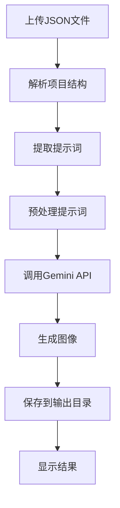
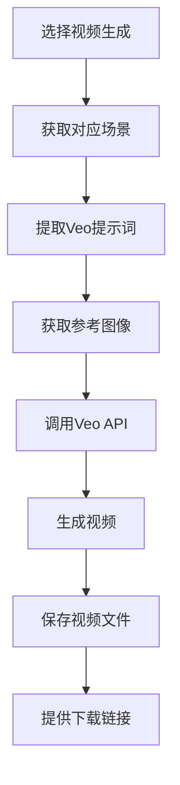
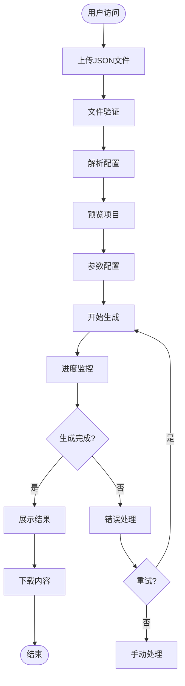

# AI图像视频生成应用产品需求文档

## 1. 产品概述

AI图像视频生成应用是一个基于人工智能技术的创意内容生成平台，用户可以通过上传JSON配置文件，自动生成高质量的图像和视频内容。产品主要服务于数字内容创作者、广告设计师、动画制作人员等创意工作者，大幅提升内容制作效率。

### 核心价值
- **自动化生成**: 从配置文件到视觉内容的全自动化流程
- **高质量输出**: 利用先进的AI模型确保生成内容质量
- **用户友好**: 简洁直观的操作界面，降低技术门槛
- **跨平台兼容**: 支持Windows、macOS、Linux多平台部署

## 2. 核心功能

### 2.1 用户角色

| 角色 | 注册方式 | 核心权限 |
|------|----------|----------|
| 普通用户 | 无需注册 | 上传配置文件、生成内容、下载结果 |
| 高级用户 | API密钥配置 | 自定义模型参数、批量处理、高级设置 |

### 2.2 功能模块

产品包含以下核心功能页面：

1. **主页**: 文件上传区域、项目概览、快速开始指引
2. **配置页面**: JSON文件编辑、参数设置、预览功能
3. **生成页面**: 进度显示、实时日志、结果预览
4. **结果页面**: 生成内容展示、下载管理、历史记录
5. **设置页面**: API密钥配置、系统设置、帮助文档

### 2.3 页面详情

| 页面名称 | 模块名称 | 功能描述 |
|----------|----------|----------|
| 主页 | 文件上传区 | 支持拖拽上传JSON文件，验证文件格式，显示上传进度 |
| 主页 | 项目预览 | 展示解析后的项目结构，包括场景和镜头信息 |
| 主页 | 快速操作 | 提供一键生成、模板选择等快捷功能 |
| 配置页面 | JSON编辑器 | 提供语法高亮、格式验证、自动补全的JSON编辑器 |
| 配置页面 | 参数面板 | 可视化配置生成参数，包括模型选择、质量设置等 |
| 配置页面 | 预览功能 | 实时预览配置效果，显示预计生成时间 |
| 生成页面 | 进度监控 | 实时显示生成进度，支持多任务并行监控 |
| 生成页面 | 日志输出 | 显示详细的生成日志，支持错误追踪 |
| 生成页面 | 中断控制 | 允许用户中断正在进行的生成任务 |
| 结果页面 | 内容展示 | 网格布局展示生成的图像和视频，支持缩略图预览 |
| 结果页面 | 下载管理 | 批量下载、选择性下载，支持多种格式导出 |
| 结果页面 | 历史记录 | 保存历史生成记录，支持重新生成和对比 |
| 设置页面 | API配置 | 管理Gemini和Veo API密钥，支持多密钥轮换 |
| 设置页面 | 系统设置 | 配置生成路径、并发数、超时时间等系统参数 |
| 设置页面 | 帮助中心 | 提供使用教程、常见问题、技术支持信息 |

## 3. 核心流程

### 3.1 图像生成流程

### 3.2 视频生成流程

### 3.3 完整工作流程

## 4. 用户界面设计

### 4.1 设计规范

**主色调**:
- 主色: #3B82F6 (蓝色) - 代表技术和创新
- 辅助色: #10B981 (绿色) - 代表成功和完成
- 警告色: #F59E0B (橙色) - 代表警告和注意
- 错误色: #EF4444 (红色) - 代表错误和失败

**按钮样式**:
- 主要按钮: 圆角矩形，蓝色背景，白色文字
- 次要按钮: 圆角矩形，白色背景，蓝色边框
- 危险按钮: 圆角矩形，红色背景，白色文字
- 禁用状态: 灰色背景，降低透明度

**字体规范**:
- 标题: Inter Bold, 24-32px
- 正文: Inter Regular, 14-16px
- 小字: Inter Regular, 12px
- 代码: JetBrains Mono, 14px

**布局风格**:
- 采用卡片式布局，内容模块化
- 响应式设计，适配不同屏幕尺寸
- 左侧导航，右侧内容区域
- 顶部工具栏，底部状态栏

### 4.2 页面设计详述

#### 4.2.1 主页设计

**文件上传区域**:
- 大尺寸拖拽区域，虚线边框
- 支持点击选择文件
- 显示文件信息和验证状态
- 上传进度条和取消按钮

**项目预览卡片**:
- 项目名称和描述
- 场景数量统计
- 预计生成时间
- 快速操作按钮

**最近项目**:
- 缩略图预览
- 生成状态标签
- 一键重新生成功能

#### 4.2.2 配置页面设计

**JSON编辑器**:
- Monaco Editor提供语法高亮
- 行号显示和代码折叠
- 实时语法检查
- 格式化按钮

**参数配置面板**:
- 分组显示不同参数类型
- 滑块和输入框混合使用
- 实时预览效果
- 参数说明提示

#### 4.2.3 生成页面设计

**进度展示**:
- 环形进度条显示总体进度
- 列表显示每个任务状态
- 实时更新的日志输出
- 预计剩余时间

**控制面板**:
- 暂停/继续按钮
- 取消全部任务按钮
- 优先级调整
- 资源使用监控

#### 4.2.4 结果页面设计

**内容网格**:
- 自适应网格布局
- 悬停显示操作按钮
- 支持全屏预览
- 文件信息显示

**批量操作**:
- 全选/反选功能
- 批量下载按钮
- 删除选中项
- 导出文件列表

### 4.3 响应式设计

**桌面端** (≥1024px):
- 完整导航菜单
- 多列内容布局
- 丰富的交互效果
- 完整的工具栏

**平板端** (768px-1023px):
- 折叠式导航菜单
- 两列内容布局
- 简化的交互效果
- 适配触摸操作

**手机端** (<768px):
- 底部导航栏
- 单列内容布局
- 触摸优先的交互
- 关键功能优先

### 4.4 交互设计

**加载状态**:
- 骨架屏占位
- 旋转加载动画
- 进度百分比显示
- 取消操作选项

**错误处理**:
- 友好的错误提示
- 重试按钮
- 错误详情展开
- 帮助文档链接

**成功反馈**:
- 成功提示消息
- 自动关闭的确认框
- 视觉反馈（颜色变化）
- 音效提示（可选）

## 5. 性能要求

### 5.1 响应时间
- 页面加载: ≤ 3秒
- API响应: ≤ 5秒
- 文件上传: ≤ 10秒（100MB文件）
- 预览生成: ≤ 2秒

### 5.2 并发处理
- 支持同时处理最多10个生成任务
- 支持最多100个用户同时在线
- 文件上传支持断点续传
- 支持任务队列管理

### 5.3 资源使用
- 前端内存占用: ≤ 200MB
- 后端内存占用: ≤ 1GB
- 临时文件自动清理
- 支持大文件分块处理

## 6. 兼容性要求

### 6.1 浏览器支持
- Chrome ≥ 90
- Firefox ≥ 88
- Safari ≥ 14
- Edge ≥ 90

### 6.2 系统支持
- Windows 10/11
- macOS 10.15+
- Ubuntu 20.04+
- CentOS 8+

### 6.3 文件格式支持
- 输入: JSON (.json)
- 图像输出: PNG, JPG, WebP
- 视频输出: MP4, WebM, MOV
- 最大文件大小: 500MB

## 7. 扩展功能

### 7.1 未来版本规划
- **模板系统**: 提供预设的项目模板
- **协作功能**: 多用户协作编辑
- **版本控制**: 支持项目版本管理
- **API集成**: 提供REST API供第三方集成
- **插件系统**: 支持自定义处理器插件
- **云端同步**: 支持云端项目同步

### 7.2 高级功能
- **批量处理**: 支持多个项目批量生成
- **定时任务**: 支持定时自动生成
- **质量评估**: 自动评估生成内容质量
- **智能优化**: 基于历史数据优化生成参数
- **多语言支持**: 支持界面多语言切换

## 8. 用户帮助

### 8.1 内置帮助系统
- **新手引导**: 首次使用的交互式教程
- **操作提示**: 关键操作的悬浮提示
- **快捷键**: 常用操作的键盘快捷键
- **视频教程**: 嵌入的帮助视频

### 8.2 文档支持
- **用户手册**: 详细的PDF用户手册
- **API文档**: 开发者API参考文档
- **FAQ**: 常见问题解答
- **更新日志**: 版本更新说明

### 8.3 技术支持
- **在线客服**: 集成在线客服系统
- **邮件支持**: 技术支持邮箱
- **社区论坛**: 用户交流社区
- **GitHub Issues**: 开源项目的问题跟踪

---

本产品需求文档详细描述了AI图像视频生成应用的功能需求、用户界面设计和使用流程，为产品开发提供明确的指导和标准。