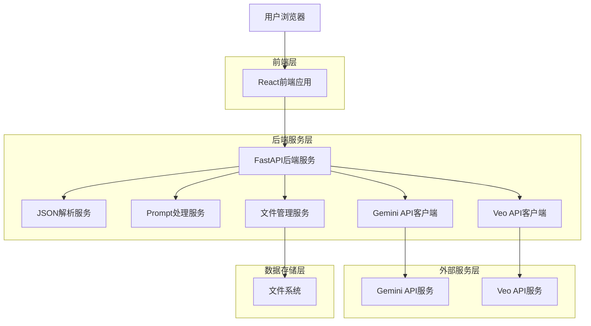
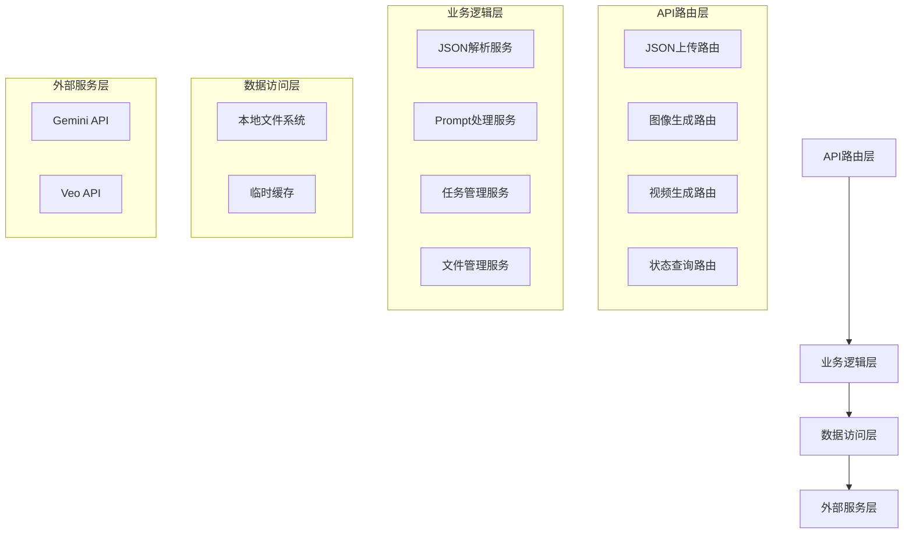

# AI图像视频生成应用技术架构文档

## 1. 架构设计

### 1.1 系统架构图



### 1.2 服务交互流程

```mermaid
sequenceDiagram
    participant UI as React UI
    participant API as FastAPI
    participant Parser as JSON Parser
    processor as Prompt Processor
    participant Gemini as Gemini Client
    participant Veo as Veo Client
    participant File as File Manager
    
    UI->>API: POST /api/upload-json
    API->>Parser: 解析JSON文件
    Parser->>Parser: 提取nano_banana_pro_prompts
    Parser->>processor: 预处理提示词
    processor->>processor: 替换占位符和引用
    
    API->>Gemini: 生成图像请求
    Gemini->>File: 保存图像文件
    File-->>API: 返回文件路径
    
    API->>Veo: 生成视频请求
    Veo->>File: 保存视频文件
    File-->>API: 返回文件路径
    
    API-->>UI: 返回生成结果
```

## 2. 技术栈描述

### 2.1 前端技术栈
- **框架**: React@18.2.0 - 现代化组件化开发框架
- **构建工具**: Vite@4.1.0 - 快速的开发构建工具
- **样式**: Tailwind CSS@3.2.0 - 实用优先的CSS框架
- **状态管理**: React Query@3.39.0 - 服务器状态管理
- **路由**: React Router@6.8.0 - 单页应用路由管理
- **HTTP客户端**: Axios@1.3.0 - 基于Promise的HTTP库
- **文件上传**: React Dropzone@14.2.0 - 拖拽上传组件
- **图标**: Lucide React@0.310.0 - 开源图标库

### 2.2 后端技术栈
- **框架**: FastAPI@0.104.1 - 现代高性能Python Web框架
- **ASGI服务器**: Uvicorn@0.24.0 - 异步服务器网关接口
- **数据验证**: Pydantic@2.5.0 - 数据验证和设置管理
- **文件处理**: aiofiles@23.2.0 - 异步文件操作
- **HTTP客户端**: httpx@0.25.0 - 异步HTTP客户端
- **环境配置**: python-dotenv@1.0.0 - 环境变量管理
- **日志**: loguru@0.7.0 - 现代化日志库
- **图像处理**: Pillow@10.1.0 - Python图像处理库

### 2.3 初始化工具
- **前端初始化**: vite-init - 快速创建Vite项目
- **后端初始化**: fastapi-cli - FastAPI项目脚手架

## 3. 路由定义

### 3.1 前端路由
| 路由 | 用途 |
|-------|---------|
| / | 主页，文件上传和参数配置 |
| /dashboard | 仪表板，显示生成进度和历史记录 |
| /results | 结果页面，展示生成的图像和视频 |
| /settings | 设置页面，API密钥和参数配置 |

### 3.2 后端API路由
| 路由 | 方法 | 用途 |
|-------|---------|---------|
| /api/health | GET | 健康检查 |
| /api/upload-json | POST | 上传JSON文件 |
| /api/generate-images | POST | 生成图像 |
| /api/generate-videos | POST | 生成视频 |
| /api/status/{task_id} | GET | 查询任务状态 |
| /api/download/{file_id} | GET | 下载生成文件 |
| /api/config | GET/POST | 获取/更新配置 |

## 4. API定义

### 4.1 文件上传API

```
POST /api/upload-json
```

请求参数:
| 参数名 | 类型 | 必需 | 描述 |
|-----------|-------------|-------------|-------------|
| file | File | 是 | JSON文件 |

响应:
| 参数名 | 类型 | 描述 |
|-----------|-------------|-------------|
| success | boolean | 上传状态 |
| data | object | 解析后的JSON数据 |
| message | string | 状态信息 |

示例:
```json
{
  "success": true,
  "data": {
    "project_id": "project-001",
    "scenes": [
      {
        "scene_id": "scene-001",
        "shots": [
          {
            "shot_id": "shot-001",
            "nano_banana_pro_prompts": {
              "start": "prompt text...",
              "middle": "prompt text...",
              "end": "prompt text..."
            }
          }
        ]
      }
    ]
  },
  "message": "JSON文件解析成功"
}
```

### 4.2 图像生成API

```
POST /api/generate-images
```

请求体:
| 参数名 | 类型 | 必需 | 描述 |
|-----------|-------------|-------------|-------------|
| project_id | string | 是 | 项目ID |
| scene_id | string | 是 | 场景ID |
| shot_id | string | 是 | 镜头ID |
| prompts | object | 是 | 提示词对象 |

响应:
| 参数名 | 类型 | 描述 |
|-----------|-------------|-------------|
| success | boolean | 生成状态 |
| task_id | string | 任务ID |
| image_paths | array | 生成的图像路径 |

### 4.3 视频生成API

```
POST /api/generate-videos
```

请求体:
| 参数名 | 类型 | 必需 | 描述 |
|-----------|-------------|-------------|-------------|
| project_id | string | 是 | 项目ID |
| scene_id | string | 是 | 场景ID |
| shot_id | string | 是 | 镜头ID |
| prompt | string | 是 | 视频生成提示词 |
| start_image | string | 否 | 起始图像路径 |
| end_image | string | 否 | 结束图像路径 |

响应:
| 参数名 | 类型 | 描述 |
|-----------|-------------|-------------|
| success | boolean | 生成状态 |
| task_id | string | 任务ID |
| video_path | string | 生成的视频路径 |

### 4.4 任务状态查询API

```
GET /api/status/{task_id}
```

响应:
| 参数名 | 类型 | 描述 |
|-----------|-------------|-------------|
| task_id | string | 任务ID |
| status | string | 任务状态(pending/running/completed/failed) |
| progress | number | 进度百分比 |
| result | object | 任务结果 |
| error | string | 错误信息 |

## 5. 服务器架构

### 5.1 后端服务分层



### 5.2 服务职责划分

**API路由层**:
- 处理HTTP请求和响应
- 参数验证和错误处理
- 请求路由分发

**业务逻辑层**:
- JSON文件解析和处理
- Prompt预处理和优化
- 任务调度和状态管理
- 文件命名和路径管理

**数据访问层**:
- 文件系统操作
- 临时数据缓存
- 日志记录和管理

**外部服务层**:
- Gemini API调用封装
- Veo API调用封装
- 错误重试和降级处理

## 6. 数据模型

### 6.1 核心数据模型

```mermaid
erDiagram
    PROJECT ||--o{ SCENE : contains
    SCENE ||--o{ SHOT : contains
    SHOT ||--o{ PROMPT : has
    SHOT ||--o{ GENERATED_FILE : produces
    
    PROJECT {
        string project_id PK
        string name
        datetime created_at
        string status
    }
    
    SCENE {
        string scene_id PK
        string project_id FK
        string name
        integer order_index
    }
    
    SHOT {
        string shot_id PK
        string scene_id FK
        string name
        integer order_index
        string veo_prompt
    }
    
    PROMPT {
        string prompt_id PK
        string shot_id FK
        string type "start|middle|end"
        string content
        string processed_content
    }
    
    GENERATED_FILE {
        string file_id PK
        string shot_id FK
        string type "image|video"
        string file_path
        string file_name
        datetime created_at
        integer file_size
    }
}
```

### 6.2 Pydantic模型定义

```python
from pydantic import BaseModel, Field
from typing import List, Optional, Dict
from datetime import datetime

class Project(BaseModel):
    project_id: str = Field(..., description="项目唯一ID")
    name: str = Field(..., description="项目名称")
    created_at: datetime = Field(default_factory=datetime.now)
    status: str = Field(default="pending", description="项目状态")

class Scene(BaseModel):
    scene_id: str = Field(..., description="场景唯一ID")
    project_id: str = Field(..., description="所属项目ID")
    name: str = Field(..., description="场景名称")
    order_index: int = Field(..., description="场景顺序")

class NanoBananaPrompts(BaseModel):
    start: str = Field(..., description="起始帧提示词")
    middle: str = Field(..., description="中间帧提示词")
    end: str = Field(..., description="结束帧提示词")

class Shot(BaseModel):
    shot_id: str = Field(..., description="镜头唯一ID")
    scene_id: str = Field(..., description="所属场景ID")
    name: str = Field(..., description="镜头名称")
    order_index: int = Field(..., description="镜头顺序")
    nano_banana_pro_prompts: NanoBananaPrompts
    veo_3_1_prompt: Optional[str] = Field(None, description="视频生成提示词")

class GeneratedFile(BaseModel):
    file_id: str = Field(..., description="文件唯一ID")
    shot_id: str = Field(..., description="所属镜头ID")
    file_type: str = Field(..., description="文件类型(image/video)")
    file_path: str = Field(..., description="文件完整路径")
    file_name: str = Field(..., description="文件名")
    created_at: datetime = Field(default_factory=datetime.now)
    file_size: int = Field(..., description="文件大小(字节)")

class TaskStatus(BaseModel):
    task_id: str = Field(..., description="任务ID")
    status: str = Field(..., description="任务状态")
    progress: float = Field(0.0, description="进度百分比")
    result: Optional[Dict] = Field(None, description="任务结果")
    error: Optional[str] = Field(None, description="错误信息")
    created_at: datetime = Field(default_factory=datetime.now)
    updated_at: datetime = Field(default_factory=datetime.now)
```

## 7. 核心服务实现

### 7.1 JSON解析服务

```python
class JSONParserService:
    """JSON文件解析服务"""
    
    def parse_project_json(self, file_path: str) -> Project:
        """解析项目JSON文件"""
        with open(file_path, 'r', encoding='utf-8') as f:
            data = json.load(f)
        
        # 提取项目信息
        project = Project(
            project_id=data.get('project_id', self.generate_project_id()),
            name=data.get('project_name', 'Untitled Project')
        )
        
        return project
    
    def extract_prompts(self, data: dict) -> List[Shot]:
        """提取提示词信息"""
        shots = []
        
        for scene in data.get('scenes', []):
            for shot in scene.get('shots', []):
                shot_data = Shot(
                    shot_id=shot['shot_id'],
                    scene_id=scene['scene_id'],
                    name=shot['name'],
                    order_index=shot['order_index'],
                    nano_banana_pro_prompts=NanoBananaPrompts(
                        start=shot['nano_banana_pro_prompts']['start'],
                        middle=shot['nano_banana_pro_prompts']['middle'],
                        end=shot['nano_banana_pro_prompts']['end']
                    ),
                    veo_3_1_prompt=shot.get('veo_3_1_prompt')
                )
                shots.append(shot_data)
        
        return shots
```

### 7.2 Prompt处理服务

```python
class PromptProcessorService:
    """提示词处理服务"""
    
    def __init__(self):
        self.style_blocks = self.load_style_blocks()
        self.ref_mappings = self.load_ref_mappings()
    
    def process_prompt(self, prompt: str) -> str:
        """处理单个提示词"""
        # 替换样式块占位符
        processed = self.replace_style_blocks(prompt)
        
        # 替换引用映射
        processed = self.replace_references(processed)
        
        return processed
    
    def replace_style_blocks(self, prompt: str) -> str:
        """替换样式块占位符"""
        for placeholder, content in self.style_blocks.items():
            prompt = prompt.replace(f"[{placeholder}]", content)
        return prompt
    
    def replace_references(self, prompt: str) -> str:
        """替换引用结构"""
        # 匹配 ([Ref: Name]) 格式的引用
        pattern = r'\(\[Ref:\s*([^\]]+)\]\)'
        
        def replace_match(match):
            ref_name = match.group(1).strip()
            return self.ref_mappings.get(ref_name, match.group(0))
        
        return re.sub(pattern, replace_match, prompt)
```

### 7.3 Gemini API客户端

```python
class GeminiAPIClient:
    """Gemini API客户端"""
    
    def __init__(self, api_key: str):
        self.api_key = api_key
        self.base_url = "https://generativelanguage.googleapis.com/v1beta"
        self.model_name = "models/gemini-3-pro-image-preview"
        self.client = httpx.AsyncClient(timeout=30.0)
    
    async def generate_image(self, prompt: str, **kwargs) -> bytes:
        """生成图像"""
        url = f"{self.base_url}/{self.model_name}:generateContent"
        
        payload = {
            "contents": [{
                "parts": [{
                    "text": prompt
                }]
            }],
            "generationConfig": {
                "temperature": kwargs.get('temperature', 0.7),
                "topK": kwargs.get('top_k', 40),
                "topP": kwargs.get('top_p', 0.95),
                "maxOutputTokens": kwargs.get('max_tokens', 2048)
            }
        }
        
        headers = {
            "Content-Type": "application/json",
            "x-goog-api-key": self.api_key
        }
        
        response = await self.client.post(url, json=payload, headers=headers)
        response.raise_for_status()
        
        # 解析响应并返回图像数据
        result = response.json()
        image_data = self.extract_image_from_response(result)
        
        return image_data
```

### 7.4 Veo API客户端

```python
class VeoAPIClient:
    """Veo API客户端"""
    
    def __init__(self, api_key: str):
        self.api_key = api_key
        self.base_url = "https://api.veo.google.com/v1"
        self.model_name = "models/veo-2.0-generate-001"
        self.client = httpx.AsyncClient(timeout=120.0)  # 视频生成可能需要更长时间
    
    async def generate_video(
        self, 
        prompt: str, 
        start_image_path: Optional[str] = None,
        end_image_path: Optional[str] = None,
        **kwargs
    ) -> str:
        """生成视频"""
        url = f"{self.base_url}/{self.model_name}:generate"
        
        # 构建请求数据
        payload = {
            "prompt": prompt,
            "aspect_ratio": kwargs.get('aspect_ratio', '16:9'),
            "duration": kwargs.get('duration', 5),
            "fps": kwargs.get('fps', 24)
        }
        
        # 如果有参考图像，添加到请求中
        files = {}
        if start_image_path:
            files['start_image'] = open(start_image_path, 'rb')
        if end_image_path:
            files['end_image'] = open(end_image_path, 'rb')
        
        headers = {
            "Authorization": f"Bearer {self.api_key}"
        }
        
        # 发送请求
        if files:
            response = await self.client.post(url, data=payload, files=files, headers=headers)
        else:
            response = await self.client.post(url, json=payload, headers=headers)
        
        response.raise_for_status()
        
        # 返回视频下载URL
        result = response.json()
        return result.get('video_url')
```

## 8. 错误处理与日志

### 8.1 错误处理策略

```python
class APIException(Exception):
    """API异常基类"""
    def __init__(self, message: str, status_code: int = 500, details: dict = None):
        self.message = message
        self.status_code = status_code
        self.details = details or {}
        super().__init__(self.message)

class JSONParseException(APIException):
    """JSON解析异常"""
    pass

class PromptProcessingException(APIException):
    """提示词处理异常"""
    pass

class ImageGenerationException(APIException):
    """图像生成异常"""
    pass

class VideoGenerationException(APIException):
    """视频生成异常"""
    pass
```

### 8.2 日志配置

```python
from loguru import logger
import sys

# 配置日志格式
log_format = (
    "<green>{time:YYYY-MM-DD HH:mm:ss}</green> | "
    "<level>{level: <8}</level> | "
    "<cyan>{name}</cyan>:<cyan>{function}</cyan>:<cyan>{line}</cyan> - "
    "<level>{message}</level>"
)

# 移除默认处理器
logger.remove()

# 添加控制台输出
logger.add(
    sys.stdout,
    format=log_format,
    level="INFO",
    colorize=True
)

# 添加文件输出
logger.add(
    "logs/app.log",
    format=log_format,
    level="INFO",
    rotation="10 MB",
    retention="30 days",
    compression="zip"
)

# 添加错误日志文件
logger.add(
    "logs/error.log",
    format=log_format,
    level="ERROR",
    rotation="10 MB",
    retention="30 days",
    compression="zip"
)
```

## 9. 性能优化

### 9.1 异步处理
- 使用async/await进行异步API调用
- 实现任务队列管理并发请求
- 支持批量处理和并行生成

### 9.2 缓存策略
- 缓存处理后的提示词
- 缓存生成的文件元数据
- 实现智能重试机制

### 9.3 资源管理
- 实现连接池复用
- 及时释放文件句柄
- 监控内存使用情况

## 10. 安全考虑

### 10.1 API安全
- API密钥存储在环境变量中
- 实现请求频率限制
- 验证输入文件格式和大小

### 10.2 文件安全
- 验证上传文件类型
- 限制文件大小
- 安全的文件命名策略

### 10.3 错误信息
- 不向客户端暴露内部错误详情
- 记录完整错误日志供调试
- 提供用户友好的错误消息

---

本技术架构文档详细描述了系统的技术选型、服务设计、API规范和实现细节，为开发团队提供完整的技术指导。